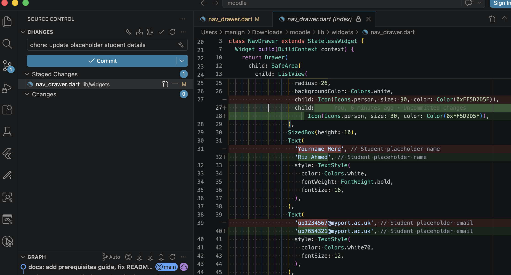
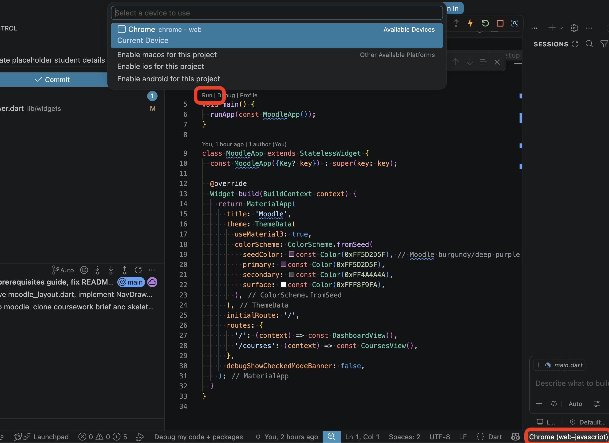
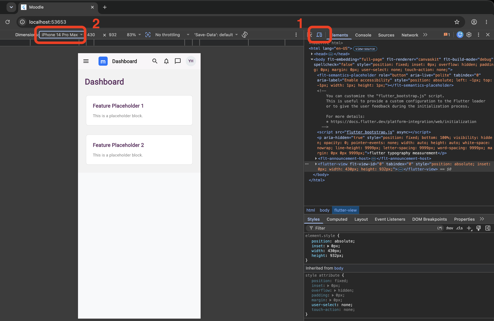

# Moodle — Coursework Template

This repository contains the starting template code for the Moodle (referral/deferral) coursework for the Flutter part of PAPL and UXDI modules.

---

## Prerequisites

Before starting, ensure your development environment is set up. You can work using:
1. **IDX / Firebase Studio** (browser-based development via [idx.google.com](https://idx.google.com))
2. **University Computers** (launch Git, Flutter SDK, and VS Code via AppsAnywhere)
3. **Personal Computer** (local installation of Git, Flutter SDK, and VS Code)

For detailed step-by-step setup guides, refer to [Worksheet 0: Git and GitHub](https://manighahrmani.github.io/sandwich_shop/worksheet-0.html) and [Worksheet 1: Flutter Setup](https://manighahrmani.github.io/sandwich_shop/worksheet-1.html).

---

## Getting Started

### Step 1: Fork the Repository

Click the **Fork** button in the top right corner of this page to create your public copy of the repository. Or just head directly to this link: <https://github.com/manighahrmani/moodle/fork>


Do not change anything on the Create fork page. You should then get a public fork of my repository with a URL like this (where `YOUR-USERNAME` is replaced with your actual GitHub username):
<https://github.com/YOUR-USERNAME/moodle>


### Step 2: Clone and Open in VS Code

Open VS Code and click the **Clone Repository** button in the Source Control panel on the left side of the screen.


Paste the URL of your forked repository and press enter. You will then be prompted to select **Open in This Window** to open the cloned repository in VS Code.


If asked to install the Flutter extension and run "flutter pub get" in the pop-ups, go ahead and install and run them.


If you do not get these pop-ups, go to the extensions tab on the left side of the screen and install the Flutter extension manually. Then, open the terminal and run `flutter pub get`. See the screenshot below for reference.


### Step 3: Complete First Setup Task

- Open the [lib/widgets/nav_drawer.dart](lib/widgets/nav_drawer.dart) file.
- Replace `"Yourname Here"` with your actual name.
- Replace `"up1234567"` with your actual UP identification number.
- Save the file and commit your change as shown below:



### Step 4: Run the Application

Set the target device from the status bar of VS Code to Chrome or Edge. Alternatively, in the integrated terminal of VS Code, run the following commands to fetch dependencies and run the app in Chrome:

```bash
flutter pub get
flutter run -d chrome
```



The application will build and open in a new Chrome browser window, displaying the Dashboard.

### Step 5: Emulate Mobile Layout in DevTools

To view the responsive layout and test your application:
- Press `F12` (or right-click anywhere and select **Inspect**) in Chrome to open Developer Tools.
- Click the **Toggle Device Toolbar** icon (or press `Ctrl+Shift+M` / `Cmd+Shift+M`) to emulate a mobile screen.
- From the left-hand side dropdown, select an iPhone (e.g., iPhone 12 Pro) to emulate a mobile layout. See the screenshot below for reference.



Remember your application must be designed for mobile devices first (we may not even run your submission on desktop layout during the demo).

---

## How you will be assessed

You will be marked during a live demo where you are quizzed on your development process and decisions. So make sure you are familiar with your own submission. Note that submitting a work that you do not understand is an academic offence and can result to a fail in the module.

Book the demo as soon as possible using the link below. Do not leave it until the last minute as the slots fill up quickly!

[Book a Demo Session](https://bookings.cloud.microsoft/bookwithme/user/e0acc34f2ca040b295fb20cfce7425a2%40port.ac.uk/meetingtype/qZuY5y_IuUimqFEq4d1oDA2?anonymous&ismsaljsauthenabled)

## Key Dates

- **Submission Deadline:** Wednesday 29th July 2026 at 13:00 (Late window ends Friday 31st July 2026 at 13:00)
- **Deadline for Demo:** The latest date you can do your demo is Monday the 3rd of August 2026.

---

## Support

If you have questions or encounter issues while working on this coursework, use [the dedicated Discord channel](https://portdotacdotuk-my.sharepoint.com/:b:/g/personal/mani_ghahremani_port_ac_uk/EbX583gvURRAhqsnhYqmbSEBwIFw6tXRyz_Br1GxIyE8dg) to ask for help. Before posting a new question, check the existing posts to see if your question has already been answered. You can also attend your timetabled practical sessions to get face-to-face support from teaching staff.

If you are facing external extenuating circumstances that are affecting your ability to complete this coursework, you should submit an [Extenuating Circumstances Form](https://myport.port.ac.uk/my-course/exams/extenuating-circumstances) as soon as possible. You are also welcome to contact me on Discord for additional support without needing to disclose the private details of your situation.
